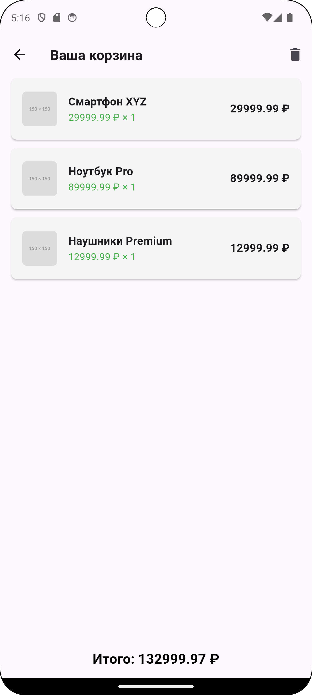

# Shopping Cart App

A simple application for managing a shopping cart with two screens: product list and cart.

Built with Flutter dart

## Technologies Used

- provider 
- Material Design

## Features

- View product list
- Add products to cart
- View cart contents
- Remove products from cart
- Calculate total order amount

***
# product_list

Простое приложение для управления корзиной покупок с двумя экранами: списком товаров и корзиной.

Написано на Flutter dart

## Использованные технологии

- provider
- Material Design

## Особенности

- Просмотр списка товаров
- Добавление товаров в корзину
- Просмотр содержимого корзины
- Удаление товаров из корзины
- Расчет общей суммы заказа

 